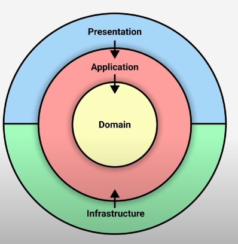
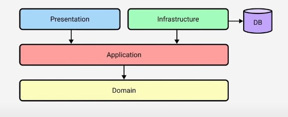

# Currency Exchange

Before running the project you need to make docker-compose up which is placed in root folder of project. 

#### Third-party libraries used in the project:
- AspNetCoreRateLimit
- Mapster
- Newtonsoft
- Serilog
- MediatR
- JwtBearer
- StackExchangeRedis
- ElasticSearch
- Kibana

#### Structure of the project:

